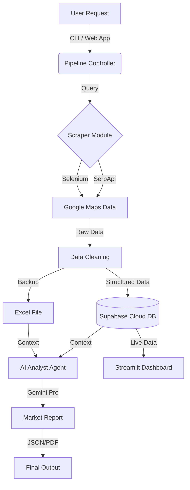

# 🏙️ CityPulse AI: Market Intelligence Agent


> **"A Production-Grade Agentic Pipeline that monitors retail markets, stores insights in the cloud, and generates AI-driven business intelligence reports."**

---

## 📖 Project Overview
I built this project to solve a real-world problem: **Automating Market Research**. 
Instead of manually searching Google Maps for hours, this Agent:
1.  **Scrapes** live data from Changanasherry (or any city).
2.  **Cleans & Normalizes** the messy data.
3.  **Stores** it in a secure Cloud Database (Supabase).
4.  **Analyzes** it using LLMs (Google Gemini) to find business opportunities.
5.  **Visualizes** everything on a live Dashboard.

---

## 🏗️ Architecture



---

## 🚀 Key Features
*   **Dynamic Scraping**: Works for any location (Kochi, Thrissur, etc.) and category.
*   **Dual-Mode Extraction**: Uses **SerpApi** for speed or **Selenium** for free scraping.
*   **Hybrid Storage**: Syncs data to **Supabase (PostgreSQL)** while keeping local Excel backups.
*   **Agentic Analysis**: An AI Agent reads the data and generates a `Market_Report.pdf` identifying gaps in the market.
*   **Interactive Dashboard**: A Streamlit app to filter and explore the data visually.

---

## 🛠️ Installation

```bash
# 1. Clone the repo
git clone https://github.com/yourusername/market-agent.git

# 2. Install dependencies
pip install -r requirements.txt

# 3. Setup Secrets
# Create a .env file and add your keys (see .env.example)
```

## ⚡ Usage

**Run the Full Pipeline (CLI):**
```bash
python pipeline.py
```

**Run the Dashboard (Web App):**
```bash
streamlit run app.py
```

---

## 👨‍💻 Tech Stack
*   **Core**: Python 3.13, Pandas
*   **Infrastructure**: Supabase (PostgreSQL), Streamlit Cloud
*   **AI**: Google Generative AI (Gemini Pro)
*   **Automation**: Python `fpdf` (PDF Generation), `selenium` (Browser Automation)

---
*Built by [Your Name] as a Portfolio Project in Agentic AI Engineering.*
